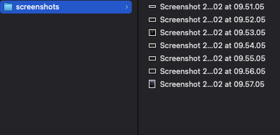
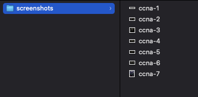

rename.sh
=========

Simple script to rename ```.png``` and ```.jpg``` files in folders by index position (given by the iteration on the file system). In addition it is possible to specify a prefix that will be set before the index.

Usage : 
```bash
./rename.sh <path-to-folder> [prefix]
```

*Before*

  

*After*

  
